# Developed by Piyusha Gurung, 77261101

## Todo List Application

Todo List App is an android application designed to streamline the workflow, boost productivity, and improve time management skills. With this app, users can simply create, modify, and remove tasks, while enjoying advanced search and drag-and-drop functionality to easily organize their to-do lists. The app's user-friendly and minimalistic UI ensures a seamless and distraction-free experience, while the MVVM design pattern and Room Database provide a robust and scalable architecture for optimal performance. With the added benefit of live data, users can instantly view changes to their to-do lists in real-time, providing a dynamic and responsive user experience. Additionally, the app features secure login and sign up functionality for users to easily save and retrieve their data, ensuring seamless access to their to-do lists across multiple devices.

## Features of Todo List Application :

1. Login and Signup for users
2. Add Todo with Title, Description with checking the priority as (Low, Medium and High)
3. Read Todo using Live Data
4. Update Todo as per the need
5. Delete Todo with a dialog box of (Yes/No)
6. Delete Todo by just swiping left
7. Search Todo with the letters
8. Implementation of MVVM Design Pattern
9. Use of Room Database
10. Minimalistic UI design and layout
11. Use of GIFs in splash screen
12. Arrange the notes by drag and drop feature

## Description of screens of the Application :

### Splash Screen 
This is the first screen that is seen by the user while running the application. In the Splash Screen, there is the use of GIF in it.

### SignUp User Screen 
For accesing the todo application, the user must sign up by adding their username, email and password on the given input fields. If the user tries to sign up without adding details inside the given input fields then an alert message is displayed on the screen that asks the user to enter the information. Also, if the user tries to sign up with the email address which is already registered into the database then again an alert message is shown as Email Already Registered. So, in that case user has to enter the unused email address while signing up.

### Login Screen 
After signing up, the user has to login by entering their email and password. If the user tries to login without adding the information in the input fields and enters invalid email or password then an alert message is displayed requesting the user to enter the valid login credentials. 

### Main Screen 
After the user is loggedin, the screen that they will view is the Main Screen where they will be able to see the add todo, search and logout features in the first place.

### Add Todo Screen 
Only when the user is logged in, they can add the todo as they like. For adding the todo, they need to fill up the title and description. Again, if the user tries to add the todo without entering the title and description then an alert message is displayed requesting the user to add the required information.

### Update Todo Screen 
The user can update their todo as per their need. If the user tries to update the todo by removing all the data from the input fields then an alert message is displayed.

### Search Todo Screen 
The user can even search their todo by entering the titles on the search bar so that they can find their todo quickly.

### Delete Todo Screen 
The user can delete their todo as well if they want to. The user can delete their todo in two ways. One by clicking one of the todo that they want to delete and just press on the delete icon. Another way that they can delete their todo is by swiping to left. Swipe left feature is implemented so that it can be more easy for the user to quickly delete the todo. A confirmation dialogue box of Yes or No is displayed before fully deleting the todo in both of the delete options.

### Home Screen 
After adding, updating, deleting, searching the todos, the remaining todo list are displayed on the home screen.

### Logout Screen 
The user can logout from their profile after the task has been completed. When the user tries to logout from their profile, then the confirmation box is appeared confirming the user if they surely want to logout from the application.

### Drag and Drop Todo Screen 
The user can arrange their todos by dragging and dropping the todo list that they have.  

The above mentioned screens as well as features are demonstrated through the medium of visuals and pictures. It is presented through screenshots and elaborated more with the help of gifs/visuals.

## Visual Demonstration of the Application :

### Fully Functioned Todo Application (Already added todo inside)
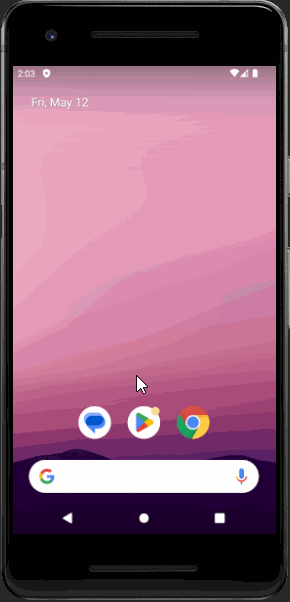 

### Fresh Todo Application (Not added todo inside)
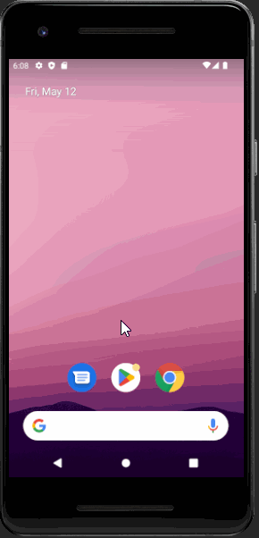

### Overall Validation Checked 
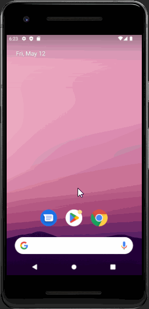 

### Create User with Validation Checked
 

### Login User with Validation Checked
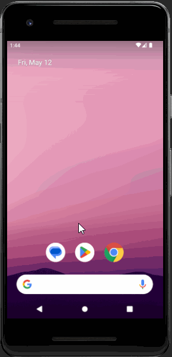 

### Add Todo with Validation Checked 
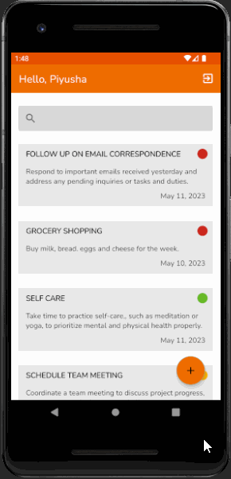 

### Update Todo with Validation Checked 
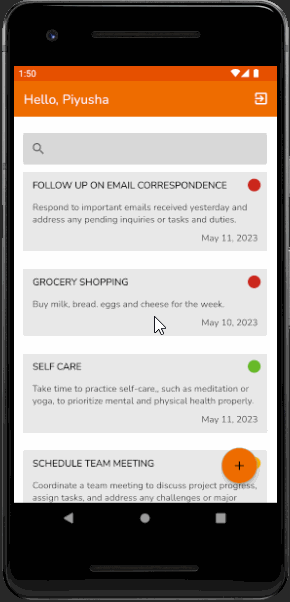 

### Delete Todo
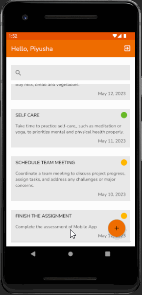 

### Swipe to Delete Todo
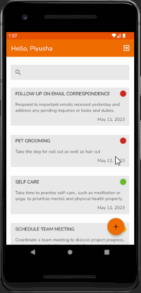 

### Search Todo 
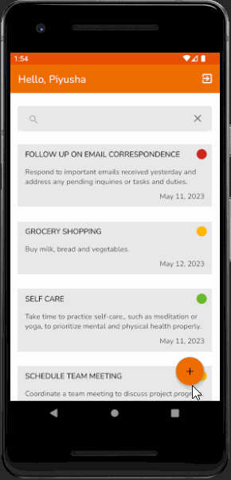 

### Drag and Drop Todo
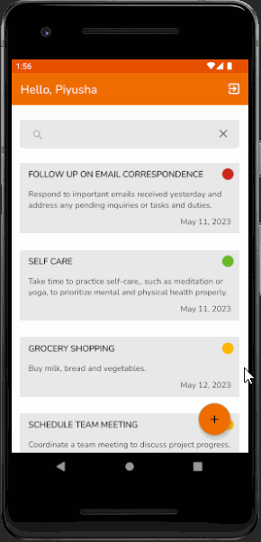 

### Logout 
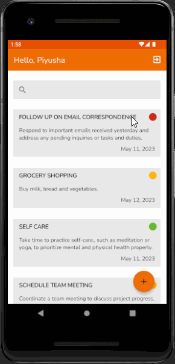 

## Mobile screens of the Application :

### Splash Screen 
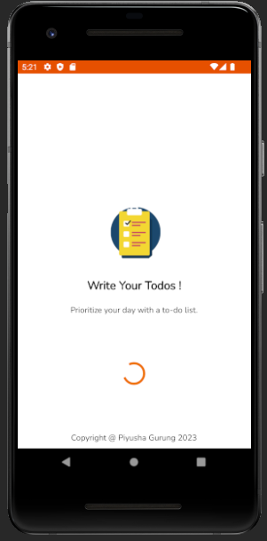 

### SignUp User Screen 
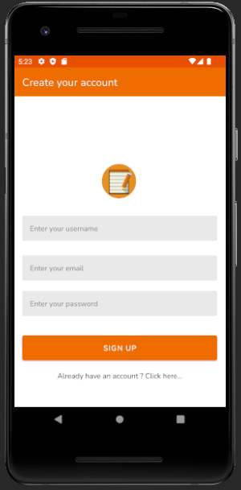

### Login Screen 
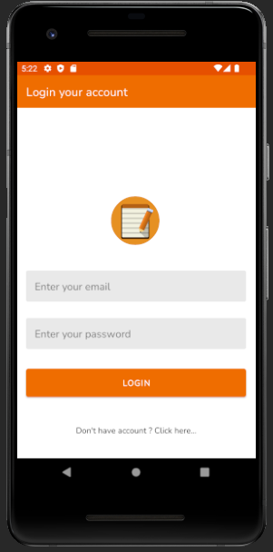

### Main Screen 
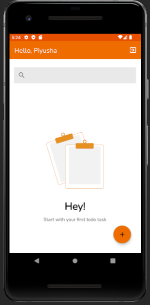

### Add Todo Screen 
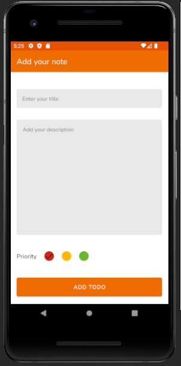

### Update Todo Screen 
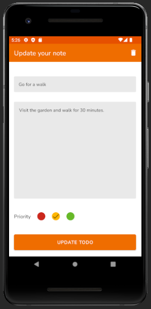

### Search Todo Screen 
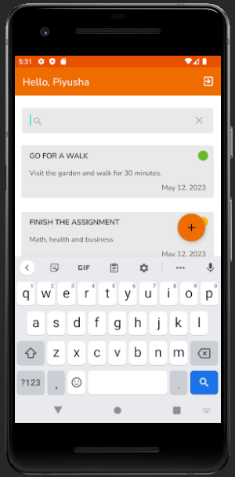

### Delete Todo Screen 
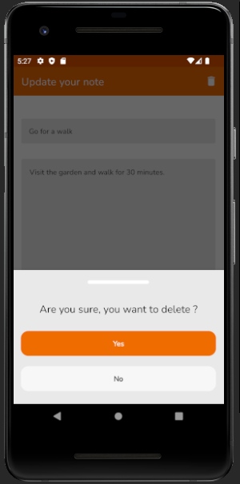

### Home Screen 
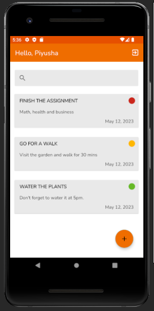

### Logout Screen 
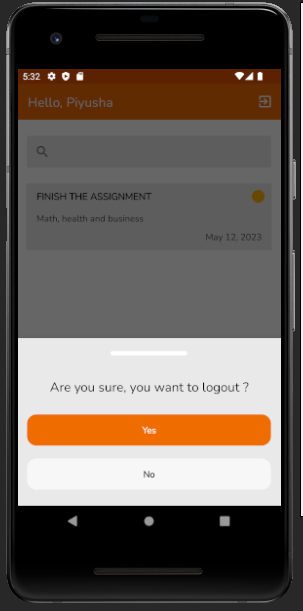

## Validation Checks on the Application :

### Sign Up Input Validation
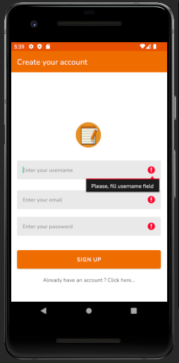

### Email Duplication Validation
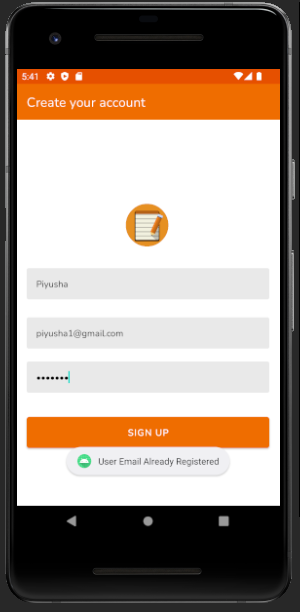

### Login Input Validation
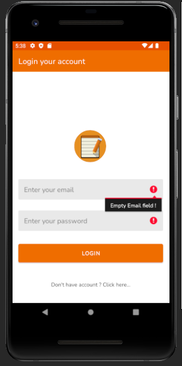

### Incorrect Credentials Validation
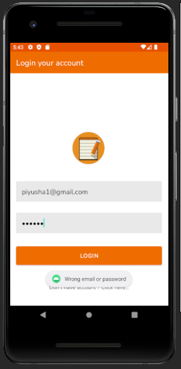

### Add Todo Validation
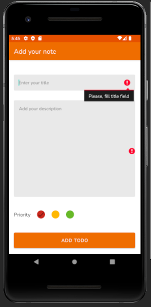

### Update Todo Validation
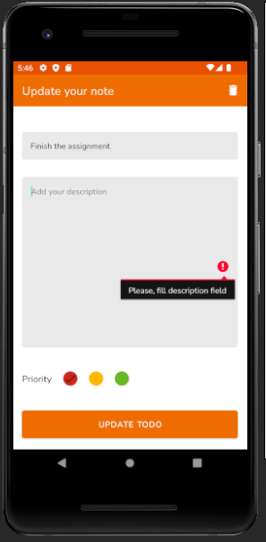

## Github Link :

https://github.com/piyusha22/Todo_App.git

